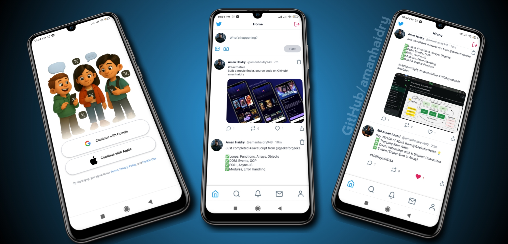
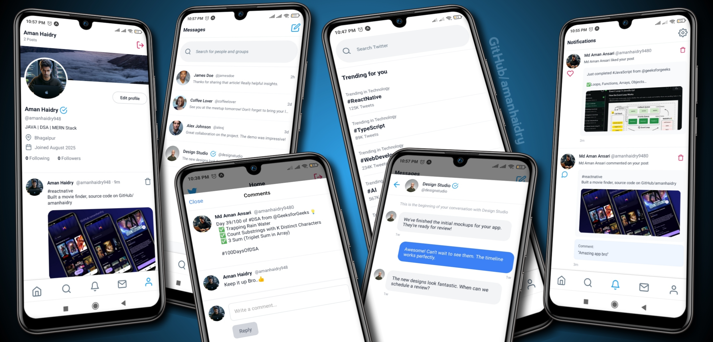

# X-App - Full-Stack Social Media Application

   

A modern full-stack social media application built with React Native (Expo) for mobile and Node.js/Express for the backend. This app provides a Twitter-like experience with features for posting, commenting, liking, and real-time notifications.
<!-- Tech stack icons -->

   
   
   
   
   
   
   
   
   
   
   
   
   
   

## 🚀 Features

   

### Mobile App (React Native/Expo)
- **Authentication**: Social login with Google and Apple using Clerk
- **Post Creation**: Create posts with text and images
- **Social Interactions**: Like, comment, and delete posts
- **User Profiles**: View and edit user profiles
- **Real-time Updates**: Live notifications and feed updates
- **Cross-platform**: Runs on iOS, Android, and Web

### Backend API (Node.js/Express)
- **RESTful API**: Clean and organized API endpoints
- **Authentication**: Secure authentication with Clerk integration
- **Database**: MongoDB with Mongoose ODM
- **File Upload**: Image handling with Cloudinary
- **Security**: Rate limiting with Arcjet
- **Notifications**: Real-time notification system

## 📱 Tech Stack

### Frontend (Mobile)
-  **React Native** with Expo
-  **TypeScript** for type safety
-  **TailwindCSS** with NativeWind for styling
-  **React Query** for data fetching and caching
-  **Clerk** for authentication
-  **Expo Router** for navigation

### Backend
-  **Node.js** with Express
-  **MongoDB** with Mongoose
-  **Clerk** for authentication
-  **Cloudinary** for image storage
-  **Arcjet** for security and rate limiting
-  **CORS** enabled for cross-origin requests

## 🛠️ Installation & Setup

### Prerequisites
-  (v16 or higher)
-  or  
-  
-   CLI (for mobile development)
-  /  (for device testing)

### Backend Setup

1. Navigate to backend directory: cd backend

2. Install dependencies: npm install

3. Environment Configuration - Create a .env file in the backend directory:
   MONGODB_URI=your_mongodb_connection_string
   CLERK_SECRET_KEY=your_clerk_secret_key
   CLOUDINARY_CLOUD_NAME=your_cloudinary_cloud_name
   CLOUDINARY_API_KEY=your_cloudinary_api_key
   CLOUDINARY_API_SECRET=your_cloudinary_api_secret
   ARCJET_KEY=your_arcjet_key
   PORT=5000

4. Start the development server: npm run dev

### Mobile App Setup

1. Navigate to mobile directory: cd mobile

2. Install dependencies: npm install

3. Environment Configuration - Update the API base URL in mobile/utils/api.ts to point to your backend server.

4. Start the Expo development server: npx expo start

5. Run on device/simulator:
   - Android: npx expo start --android
   - iOS: npx expo start --ios
   - Web: npx expo start --web

## 🔧 API Endpoints

### Authentication
- All protected routes require authentication via Clerk

### Posts
- GET /posts - Get all posts
- POST /posts - Create a new post
- DELETE /posts/:id - Delete a post
- POST /posts/:id/like - Like/unlike a post

### Comments
- GET /comments/post/:postId - Get comments for a post
- POST /comments/post/:postId - Create a comment
- DELETE /comments/:commentId - Delete a comment

### Users
- GET /users/me - Get current user
- POST /users/sync - Sync user with Clerk
- PUT /users/profile - Update user profile

## 🚀 Deployment

### Backend (Vercel)
The backend is configured for Vercel deployment with vercel.json. Simply connect your repository to Vercel and deploy.

### Mobile App
- Expo Application Services (EAS): For building and distributing the app
- App Store/Google Play: For production releases

## 🔐 Environment Variables

### Backend
MONGODB_URI=mongodb://localhost:27017/xapp
CLERK_SECRET_KEY=your_clerk_secret_key
CLOUDINARY_CLOUD_NAME=your_cloud_name
CLOUDINARY_API_KEY=your_api_key
CLOUDINARY_API_SECRET=your_api_secret
ARCJET_KEY=your_arcjet_key
PORT=5000

### Mobile
Update the API base URL in mobile/utils/api.ts based on your environment:
- Development: http://localhost:5000/api
- Production: https://your-backend-domain.com/api

## 🧪 Development

### Running Tests
Backend: cd backend && npm test
Mobile: cd mobile && npm test

### Linting
Mobile: cd mobile && npm run lint

## 📱 Features in Detail

### Authentication
- Seamless social login with Google and Apple
- Secure token-based authentication
- Automatic user synchronization

### Post Management
- Rich text posts with image support
- Real-time like/unlike functionality
- Post deletion with proper authorization

### Comments System
- Threaded comments on posts
- Real-time comment notifications
- Comment deletion by author

### User Profiles
- Profile viewing and editing
- User post history
- Avatar and bio management

---

Built with ❤️ using React Native, Node.js, and modern web technologies.